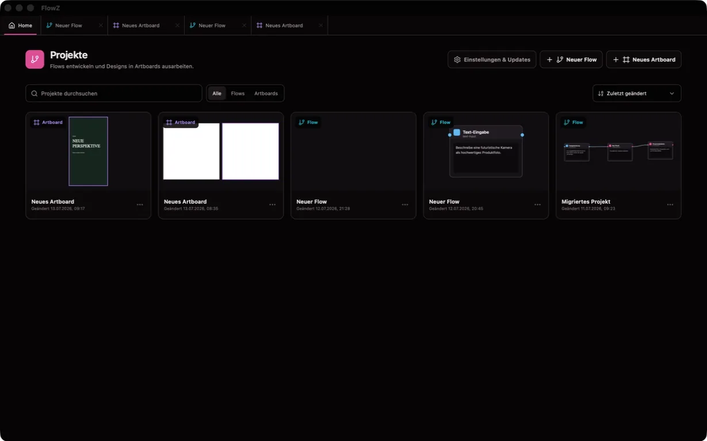
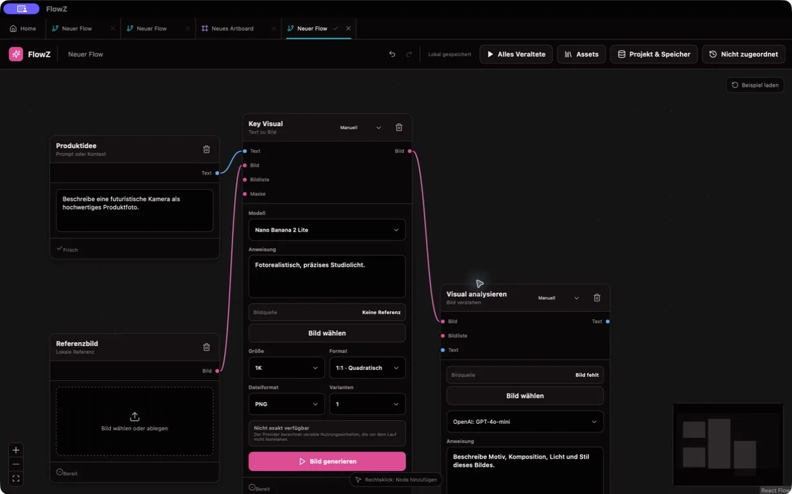
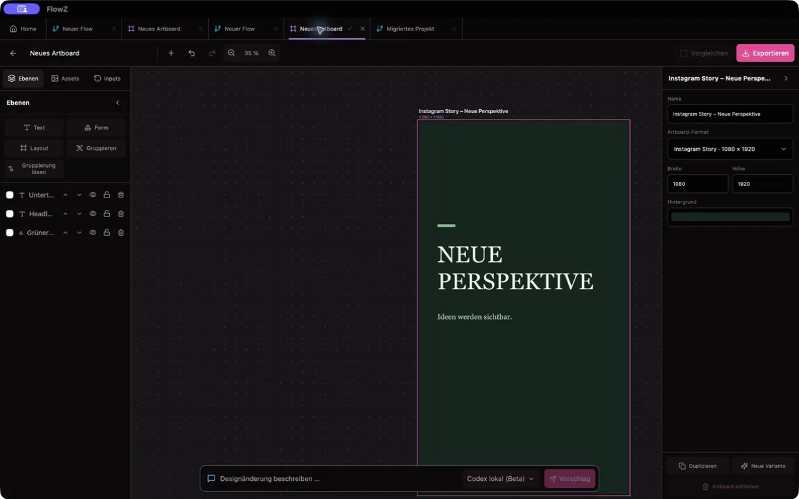

<p align="center">
  
</p>

<h1 align="center">FlowZ</h1>

<p align="center">
  <strong>Eine visuelle Werkbank für zusammenhängende Content- und Marken-Workflows.</strong><br>
  Texte, Bilder, Videos, Recherche, Markenbausteine und Artboards in einer lokalen macOS-App verbinden.
</p>

<p align="center">
  macOS · Apple Silicon · Tauri 2 · lokale Projektbibliothek
</p>

---

FlowZ ordnet kreative Arbeit als nachvollziehbaren Flow statt als Folge voneinander getrennter Chats. Eingaben, generierte Varianten und Werkzeuge werden über typisierte Verbindungen kombiniert. Ergebnisse bleiben mit ihrem Entstehungskontext im Projekt erhalten und können später erneut ausgewählt oder weiterverwendet werden.

> FlowZ befindet sich in aktiver Entwicklung. Aktuell werden unsignierte Builds für Apple-Silicon-Macs bereitgestellt.

## Wofür FlowZ gedacht ist

| Entwickeln | Generieren | Ausarbeiten |
| --- | --- | --- |
| Markenbriefing, Zielgruppe, Namensideen, Domains, Social-Handle-Plan, Farbpalette und Font-Pairing | Text, Bild und Video mit modellspezifischen Eingaben, Varianten und Kostenanzeige | Mehrere Artboards, Ebenen, Assets, Formate, Varianten und agentengestützte Designvorschläge |

Der Canvas bleibt dabei der gemeinsame Kontext: Ein freigegebenes Markenbriefing kann beispielsweise Zielgruppenanalyse, Namensfindung, Domainprüfung, visuelle Richtung und spätere Mediengenerierung speisen. Bild- und Videoergebnisse lassen sich als Referenzen weiterreichen, ohne sie zwischen einzelnen Werkzeugen manuell neu zu organisieren.

## Drei Arbeitsbereiche

### Home

Die lokale Projektübersicht verwaltet Flow- und Artboard-Dokumente. Hier werden Projekte erstellt, wieder geöffnet, umbenannt, dupliziert oder gelöscht. Auch die App-Einstellungen sind zentral von der Übersicht aus erreichbar.

### Flow-Canvas

Nodes werden direkt am Canvas über das Kontextmenü oder beim Loslassen einer noch offenen Verbindung erstellt. Typisierte Anschlüsse begrenzen die Auswahl auf kompatible Nodes. Ergebnisverläufe, Varianten, lokale Eingaben und explizite Provider-Ausführungen bleiben voneinander unterscheidbar.

### Artboards

Der Artboard-Arbeitsbereich ist ein eigener Design-Canvas und keine vergrößerte Flow-Node. Er unterstützt mehrere Boards und Formate innerhalb eines Dokuments, Ebenen, Text, Formen, Layout-Container, Bilder, lokale Fonts, Export sowie Vorschläge des Design-Agenten über Codex oder OpenRouter. Agentenvorschläge werden vor dem Anwenden als Änderungssatz behandelt.

#### Projekte auf einen Blick



#### Inhalte als nachvollziehbarer Flow



#### Varianten im eigenen Design-Canvas



## Was bereits zusammenarbeitet

- **Text und Analyse:** Textgenerierung, Varianten, Bildanalyse, Markdown-Ausgabe und Audio-Transkription.
- **Bild:** fal.ai-Bildgenerierung mit modellabhängigen Optionen, Referenzbildern und Kosteninformationen sowie Upscaling, Hintergrundentfernung, Formattransformation und deterministisches Beschneiden transparenter Ränder.
- **Video:** fal.ai-Videogenerierung mit automatisch gewähltem Endpoint für die vorhandenen Eingaben, soweit vom Modell unterstützt mit Startbild, Endbild, Referenzen, Dauer, Auflösung und Audio. Start- und Endframe stehen anschließend als eigene Ausgaben bereit.
- **Kontext und Recherche:** Webseiten-Kontext, Brave-Search-Recherche und wiederverwendbare Text- oder Bild-Assets aus der lokalen Bibliothek.
- **Markenentwicklung:** Briefing, Zielgruppe, Namensideen, Domainstatus, Social-Handle-Prüfpfade, visuelle Font-Pairing-Beispiele, Farbpaletten und Logo-Workflows.
- **Verlauf und Wiederverwendung:** Projektbezogene Result-History, aktive Varianten, Asset-Bibliothek, lokale Medienablage und Export an der jeweiligen Ergebnis- oder Artboard-Stelle.

## Provider: klare Rollen

| Provider | Aufgabe in FlowZ | Wann Daten die App verlassen |
| --- | --- | --- |
| **OpenRouter** | Textgenerierung, sprach- und bildbasierte Analyse sowie Transkription. Keine Bild- oder Videogenerierung. | Nur bei einer ausdrücklich gestarteten zugehörigen KI-Node oder einem OpenRouter-Artboard-Agentenlauf. |
| **fal.ai** | Bild- und Videogenerierung sowie konfigurierte visuelle Cloud-Werkzeuge. Referenzmedien werden dafür über die fal.ai-Infrastruktur bereitgestellt. | Nur bei einer ausdrücklich gestarteten visuellen Generierung oder Cloud-Transformation. |
| **Brave Search** | Webrecherche innerhalb der Recherche-Node. | Nur wenn eine Recherche ausgeführt wird; der Schlüssel ist optional. |
| **Codex lokal** | Standardagent für Artboard-Vorschläge über die lokal verfügbare Codex-Integration. | Entsprechend der lokal eingerichteten Codex-Umgebung; FlowZ benötigt dafür keinen OpenRouter-Schlüssel. |

## Erste Schritte

1. FlowZ installieren und beim ersten Start die macOS-Hinweise unter [Installation ohne Apple-Signierung](#installation-ohne-apple-signierung) beachten.
2. Auf **Home → Einstellungen** nur die Provider-Schlüssel eintragen, die für den eigenen Workflow gebraucht werden.
3. Einen neuen Flow erstellen und per Rechtsklick auf den Canvas die erste Eingabe- oder Generierungs-Node hinzufügen.
4. Kompatible Anschlüsse verbinden. Eine Verbindung kann am Input erneut gegriffen, umgehängt oder durch Loslassen im Leeren entfernt werden.
5. Kostenpflichtige KI-Nodes gezielt ausführen. Deterministische Eingaben und lokale Transformationen speichern sich ohne zusätzlichen Ausführen-Button und markieren abhängige Ergebnisse als veraltet.
6. Für Layouts ein Artboard-Dokument öffnen oder eine Artboard-Node mit einem Artboard-Dokument verknüpfen.

## Lokal, nachvollziehbar und kostenbewusst

- Projekte, Graphen, Artboards, Medien, aktive Ergebnisvarianten und Verläufe werden in der lokalen FlowZ-Bibliothek gespeichert.
- Provider-Schlüssel liegen im macOS-Schlüsselbund unter `dev.flowz.app`; sie werden nicht in Projektgraphen oder `localStorage` geschrieben.
- FlowZ startet keine kostenpflichtige KI-Ausführung automatisch. Jeder Providerlauf braucht eine ausdrückliche Nutzeraktion.
- Voraussichtliche und tatsächlich gemeldete Providerkosten werden getrennt behandelt. Wo ein Provider keine feste Vorabschätzung erlaubt, können frühere tatsächliche Läufe als Schätzgrundlage dienen.
- Bei Cloud-Ausführungen werden die für den Auftrag benötigten Prompts und Medien an den gewählten Provider übertragen. Lokale Speicherung bedeutet nicht, dass eine bewusst gestartete Cloud-Generierung offline ausgeführt wird.

## Installation ohne Apple-Signierung

GitHub Releases werden derzeit für Apple-Silicon-Macs (`aarch64`) gebaut. Für die Installation wird nur die **DMG-Datei** benötigt. FFmpeg und FFprobe sind bereits in FlowZ eingebettet und erscheinen nicht als separate Nutzerdownloads.

Die App und ihre Sidecars erhalten eine ad-hoc Signatur, aber keine Apple Developer-ID-Signatur und keine Notarisierung. macOS kann den ersten Start deshalb blockieren.

1. Die DMG und `SHA256SUMS.txt` aus dem [offiziellen FlowZ-Releasebereich](https://github.com/ibimspumo/FlowZ/releases) in dasselbe Verzeichnis laden.
2. Vor der Installation die Prüfsumme kontrollieren:

   ```bash
   cd ~/Downloads
   grep 'FlowZ_.*_aarch64\.dmg$' SHA256SUMS.txt | shasum -a 256 -c -
   ```

3. Nur bei der Ausgabe `OK` fortfahren und FlowZ aus dem DMG nach `/Applications` ziehen.
4. Zuerst per Rechtsklick auf FlowZ → **Öffnen** versuchen. Alternativ in **Systemeinstellungen → Datenschutz & Sicherheit** bei FlowZ **Dennoch öffnen** wählen.
5. Wenn Gatekeeper die direkt aus dem offiziellen Repository geladene App weiterhin wegen des Quarantäneattributs blockiert:

   ```bash
   xattr -dr com.apple.quarantine "/Applications/FlowZ.app"
   ```

Der letzte Befehl entfernt Quarantäneattribute rekursiv und sollte nur für eine zuvor anhand von `SHA256SUMS.txt` geprüfte FlowZ-App verwendet werden.

## Entwicklung

### Voraussetzungen

- macOS mit den [Tauri-2-Systemvoraussetzungen](https://v2.tauri.app/start/prerequisites/)
- Node.js 22.13 oder neuer
- Rust
- pnpm 11.10.0 über Corepack

### Lokale App starten

```bash
corepack prepare pnpm@11.10.0 --activate
corepack pnpm install --frozen-lockfile
corepack pnpm tauri dev
```

`corepack pnpm dev` startet nur die Oberfläche im Browser. Schlüsselbund-, Projektablage- und Provideraufrufe sind dort bewusst deaktiviert. Für echte End-to-End-Provider-Tests ist deshalb `corepack pnpm tauri dev` erforderlich.

### Prüfen und bauen

```bash
corepack pnpm test
corepack pnpm build
cargo test --manifest-path src-tauri/Cargo.toml
```

### Produktaufnahmen

Die eingebundenen Home-, Flow- und Artboard-Aufnahmen stammen aus dem nativen Release-Smoke-Test. Verbindliche Dateinamen und Kriterien stehen unter [`docs/screenshots/README.md`](docs/screenshots/README.md). Fehleraufnahmen aus `artifacts/runtime-product-smoke/` dürfen dafür nicht wiederverwendet werden.

### App-Icon aktualisieren

Das manuell gepflegte Master-Asset liegt unter [`assets/icon/flowz-icon-master-1024.png`](assets/icon/flowz-icon-master-1024.png) in 1024 × 1024 Pixeln.

```bash
corepack pnpm icons
corepack pnpm run verify:icons
```

Die erzeugten Tauri-, macOS- und Web-Formate werden mit eingecheckt, damit CI während eines Releases keine Assets stillschweigend verändert.

## Updates und Releases

Unter **Einstellungen → FlowZ Updates** wird manuell nach Updates gesucht. Download und Installation brauchen eine ausdrückliche Aktion; der anschließende Neustart bleibt eine eigene Entscheidung. Updater-Pakete werden mit dem separaten Tauri-Updater-Schlüssel signiert und vor der Installation geprüft. Dafür ist kein Apple Developer Account nötig.

Ein Release-Tag muss exakt zur Version in `package.json`, `src-tauri/tauri.conf.json` und `src-tauri/Cargo.toml` passen:

```bash
corepack pnpm run verify:release -- v0.1.3
git tag v0.1.3
git push origin v0.1.3
```

Die GitHub Action veröffentlicht DMG, Tauri-Updater-Archiv, Signatur, `latest.json` und `SHA256SUMS.txt`. FFmpeg und FFprobe bleiben Bestandteil der App und werden nicht als eigene Nutzerdownloads veröffentlicht.

Der private Updater-Schlüssel gehört nie ins Repository. Die Pipeline liest `TAURI_SIGNING_PRIVATE_KEY` und `TAURI_SIGNING_PRIVATE_KEY_PASSWORD` aus dem geschützten GitHub-Environment `release-signing`. Der Workflow akzeptiert nur stabile Tags auf einem Commit von `main`, dessen normaler CI-Lauf erfolgreich war.

Eine vollständige lokale Release-Probe ohne Tag, Upload oder GitHub-Release:

```bash
bash scripts/rehearse-macos-release.sh
```

Weitere Details zu Vertrauensgrenzen, Sidecars und dem Clean-Checkout-Gate stehen in [`docs/release-security.md`](docs/release-security.md).
